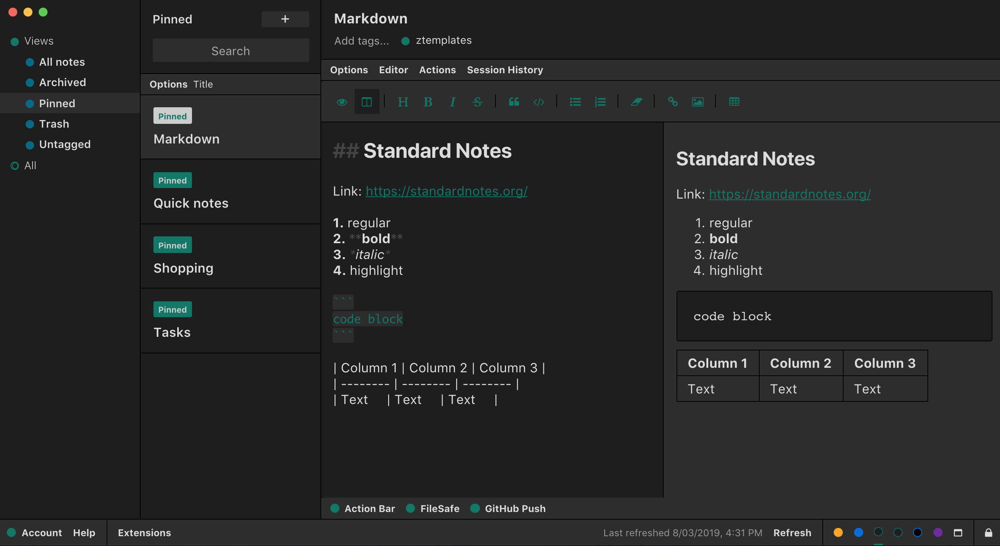

# Muted Dark Theme

Standard Notes dark theme with non-vivid, muted colors  

## Installation

1. Click "Extensions" > "Import Extension".
2. Paste the URL into the text box, then press Enter:
    https://listed.standardnotes.org/bnBSh1rzUL

3. Click "Install" > "Activate".

